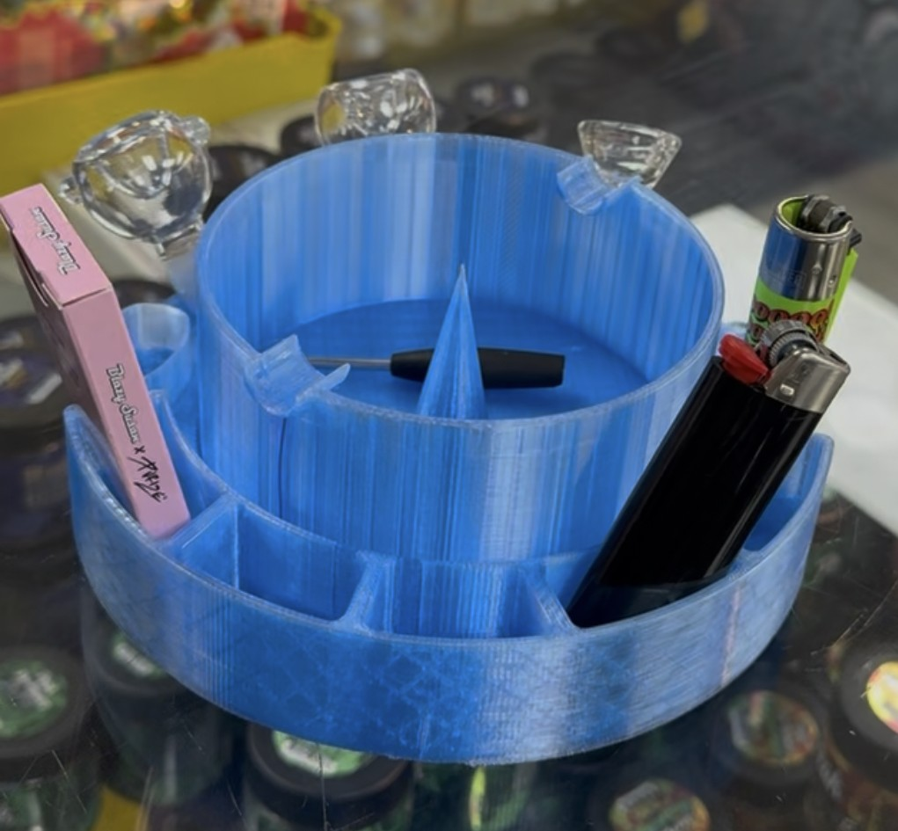
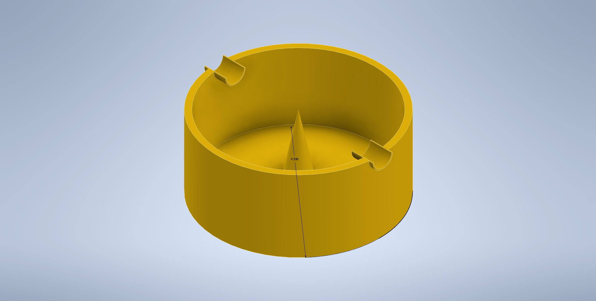
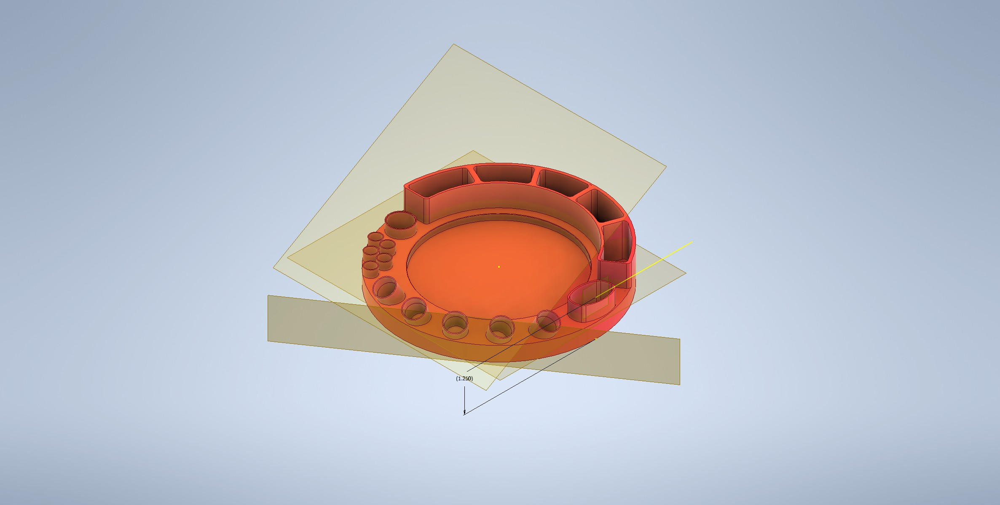

# Debowler

  

<h1 align="center">Custom Debowler / Ashtray Combo</h1>

  Designed in Autodesk Inventor · 100 % 3-D printable · Sold at <em>Vapors Smoke Shop</em>

---

## ✨ Features

| Zone                        | What it does                                        | Qty / Size            |
|-----------------------------|-----------------------------------------------------|-----------------------|
| **Ashtray core**           | 4.5 in OD bowl with **coned debowler** in the centre | —                     |
| **Joint / cone rests**     | Tapered cut-outs for pre-rolls                      | 2                     |
| **14 mm slide rack**       | Angled parking for glass slides                   | **5 × Ø14 mm**        |
| **Bic holster**            | Snug friction-fit for a standard Bic lighter        | 1                     |
| **Tool wells**             | Mini sleeves for pokers / dab tools                 | 5 × Ø7.62 mm             |
| **Catch-all pocket**       | stash for cotton swabs, pearls, etc.     | 1                     |

## 📸 Gallery
| Ashtray top | Organizer base |
|:--:|:--:|
|  |  |

> **Tip:** Click any *.stl* in **models/** – GitHub opens an interactive 3-D viewer.

## 🖨️ Print Guide

| Setting        | Value       |
|----------------|-------------|
| Layer height   | 0.2 mm      |
| Walls          | 3           |
| Infill         | 20 % gyroid |
| Material       | PETG (heat-resistant) |
| Supports       | none needed |
| Nozzle / Bed   | 240 °C / 80 °C |

